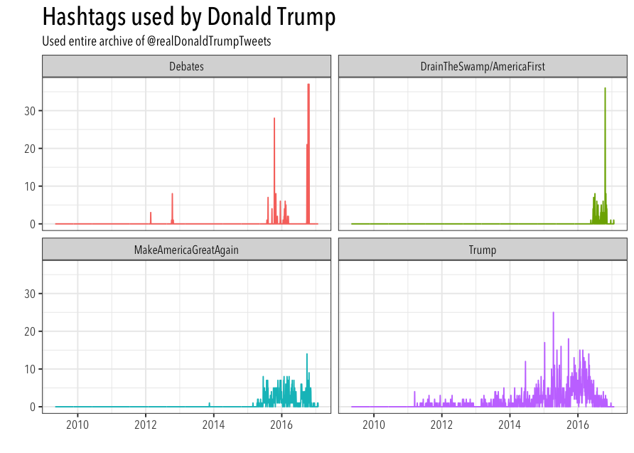
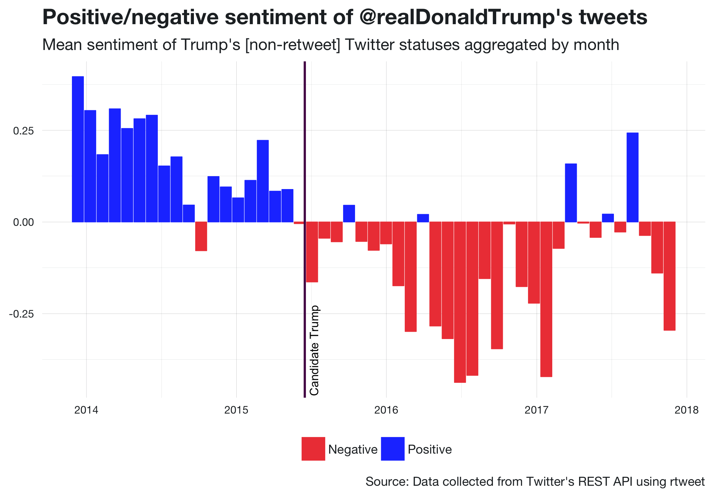
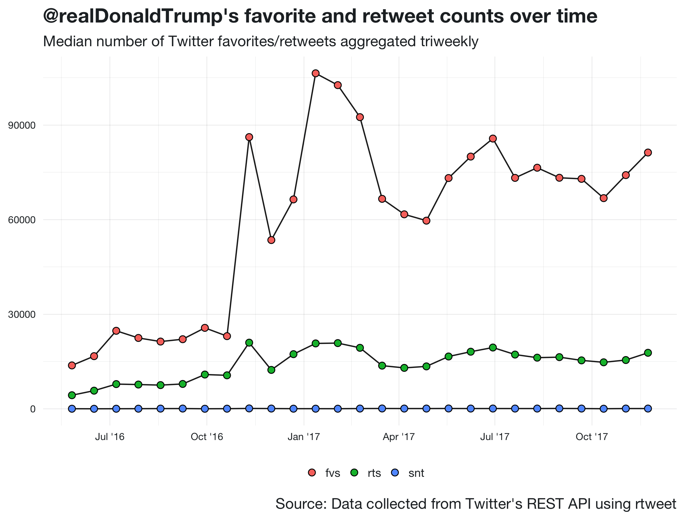

## Read data


```{r}
## read csv file
#rdt <- read.csv("data/trumptweets-1515775693.tweets.csv")
rdt <- readRDS("data/trumptweets-1515775693.rds")

## preview data
rdt
```

## Download all of Donald Trump's tweets using R

1. Install and load rtweet. `

```{r, eval=FALSE}
## install rtweet package
install.packages("rtweet")

## alternatively, install dev version
if (!"devtools" %in% installed.packages()) {
  install.packages("devtools")
}
devtools::install_github("mkearney/rtweet")

## load rtweet
library(rtweet)
```

2. Read in the following 3 functions. You'll use the last
function, `trumptweets()`, to download the data.

```{r, eval=FALSE}
#' get_trumptwitterarchive
#'
#' Returns data from trumptwitterarchive.com.
#'
#' @param years Years from which to collect data. Defaults (NULL, TRUE, or "all")
#'   to 2008-current year.
#' @return Returns data frame (tbl) of status IDs with "data" attribute consisting of
#'   list of data by year.
#' @importFrom jsonlite fromJSON
#' @importFrom tibble as_tibble
#' @examples
#' \dontrun{
#' ## get data
#' tta <- get_trumptwitterarchive()
#'
#' @export
get_trumptwitterarchive <- function(years = NULL) {
  ## default to years 2008 through current
  if (is.null(years) || isTRUE(years) || identical(tolower(years), "all")) {
    years <- seq(2009, as.integer(format(Sys.Date(), "%Y")))
  }
  stopifnot(is.numeric(years))
  ## get data for each year
  tta <- lapply(years, trumptwitterarchive_)
  ## make status IDs data frame with tta as attribute
  ids <- lapply(tta, "[[", "id_str")
  ids <- tibble::as_tibble(
    list(status_id = unlist(ids)),
    validate = FALSE
  )
  ## list of data (element = year)
  attr(ids, "data") <- tta
  attr(ids, "years") <- years
  ids
}

#' trumptwitterarchive_data
#'
#' Extracts full trumptwitterarchive data
#'
#' @param data Data frame returned by \code{\link{get_trumptwitterarchive}} with
#'   "data" attribute.
#' @param years Optional integer used to subset data to return only certain years.
#'   Defaults to NULL, which means all data is returned.
#' @return List of full data from trumptwitterarchive.com.
#' @export
trumptwitterarchive_data <- function(data, years = NULL) {
  if (!"data" %in% names(attributes(data))) {
    stop("Archive data not found", call. = FALSE)
  }
  tta <- attr(data, "data")
  ## by default, return tta data
  if (is.null(years)) {
    return(tta)
  }
  ## if years to subset are provided
  data_years <- attr(data, "years")
  ## if no years attr or if years length differs return w/ warning
  if (is.null(data_years) || length(data_years) != length(years)) {
    warning(
      "Length of years attribute differs from length of data. Returning all extracted data",
      call. = FALSE
    )
  } else {
    tta <- tta[data_years %in% years]
  }
  tta
}


#' trumptwitterarchive_
#'
#' Internal function used to retrieve trumptwitterarchive data
#'
#' @param year Integer, specifying year of data to return.
#' @param fromJSON Logical, indicating whether to convert repsonse object to
#'   nested list object.
#' @return Response object from trumptwitterarchive request converted (by default)
#'   to R-friendly list object.
#' @importFrom httr content GET
#' @importFrom jsonlite fromJSON
#' @noRd
#' @keywords internal
trumptwitterarchive_ <- function(year, fromJSON = TRUE) {
  ## build and send request
  url <- paste0(
    "http://trumptwitterarchive.com/",
    "data/realdonaldtrump/",
    year,
    ".json"
  )
  ## response object
  r <- httr::GET(url)
  ## check html status
  httr::warn_for_status(r)
  ## if fromJSON then convert to list otherwise return response object
  if (fromJSON) {
    r <- httr::content(r, "text")
    ## if html return empty data frame
    if (grepl("^\\<\\!DOCTYPE", r)) {
      r <- data.frame()
    } else {
      r <- jsonlite::fromJSON(r)
    }
  }
  r
}

## function to download status ids
trumpids <- function(trumptwitterarchive = TRUE) {
    ## scrape from trumptwitterarchive.com
    if (trumptwitterarchive) {
        ids <- c(2009:2017) %>%
            lapply(.trumpids) %>%
            unlist(use.names = FALSE)
    } else {
        ## or from my github page (note: this one is unlikely to
        ## be updated as frequently as trumptwitterarchive)
        ids <- paste0(
            "https://github.com/mkearney/trumptweets/blob/",
            "master/data/realdonaldtrump-ids-2009-2017.csv") %>%
            read.csv(stringsAsFactors = FALSE) %>%
            unlist(use.names = FALSE)
    }
    ## return ids
    ids
}

## function to download twitter data
trumptweets <- function() {
    ## get archive of status ids
    ids <- trumpids()
    ## get newest trump tweets (set to 1000 to be safe)
    rt1 <- get_timeline(
        "realdonaldtrump", n = 1000,
        since_id = ids[length(ids)])
    ## download archive
    message("    Downloading ", length(ids), " tweets...")
    rt2 <- lookup_statuses(ids[1:16000])
    message("    You're halfway there...")
    rt3 <- lookup_statuses(ids[16001:(length(ids))])
    message("    Huzzah!!!")
    ## combine data into list
    rt <- list(rt1, rt2, rt3)
    ## collapse into data frame (or salvage list if error)
    tryCatch(do.call("rbind", rt),
             error = function(e) return(rt))
}
```

3. Download all of Trump's tweets.

```{r, eval=FALSE}
## run function to download Trump's twitter archive
djt <- trumptweets()
```

4. Save the data file.

```{r, eval=FALSE}
## To save as an excel file:
install.packages("openxlsx")
openxlsx::write.xlsx(djt, "realdonaltrump-fullarchive.xlsx")

## To save as csv file
write.csv(djt, "realdonaltrump-fullarchive.csv",
          row.names = FALSE)

## To preserve meta information and save as csv file
install.packages("readr")
readr::write_csv(djt, "realdonaltrump-fullarchive.csv")
```

## Inspecting the data

```{r, eval=FALSE}
## preview data
head(djt)

## check 100 most popular hashtags
djt$hashtags %>%
    strsplit(" ") %>%
    unlist(use.names = FALSE) %>%
    tolower %>%
    table() %>%
    sort(decreasing = TRUE) %>%
    head(100)

## check 100 most popular mentions
djt$mentions_screen_name %>%
    strsplit(" ") %>%
    unlist(use.names = FALSE) %>%
    tolower %>%
    table() %>%
    sort(decreasing = TRUE) %>%
    head(100)

## check text of 50 most recent tweets
djt$text[1:50]
```

## Plotting the data

```{r, eval = FALSE}
## use the built in rtweet function
ts_plot(p, theme = "nerdy")

## plot four groups of hashtags
p <- ts_filter(djt, "2 days", txt = "hashtags",
               filter = c("makeamericagreatagain|maga",
                          "trump",
                          "debate",
                          "draintheswamp|americafirst"),
               key = c("MakeAmericaGreatAgain",
                       "Trump",
                       "Debates",
                       "DrainTheSwamp/AmericaFirst"))

## you can continue plotting with rtweet functions but
## the current version (0.4.0) prints incorrect labels for
## the x-axis for multi-year plots.
ts_plot(p, theme = "spacegray")

## ggplot2 doesn't have that problem and is more robust and
## flexible anyway
## install and load ggplot2
install.packages("ggplot2")
library(ggplot2)

## uncomment following line and final line to save image
## png("trumptweets.png", 7, 5, "in", res = 127.5)
p %>%
    ggplot(aes(x = time, y = freq, color = filter)) +
    theme_bw() +
    geom_line() +
    facet_wrap( ~ filter, ncol = 2) +
    labs(x = "", y = "",
         title = "Hashtags used by Donald Trump",
         subtitle = "Used entire archive of @realDonaldTrumpTweets") +
    theme(legend.position = "none",
          text = element_text(size = 12,
                              family = "Avenir Next Condensed"),
          plot.title = element_text(
              family = "Avenir Next Condensed Medium", size = 20))
## dev.off()

## image I created using this code displayed below

## note: if Avenir Next Condensed will only work if currently
## installed on your machine. If that's the case, then either
## delete the family arguments or replace Avenir with the font
## of your choosing.
```

<p align="center">

</p>


<p align="center">

</p>


<p align="center">

</p>
